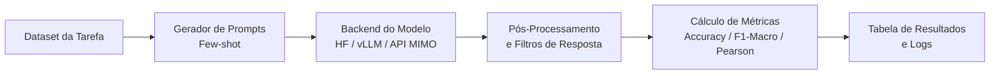

# 📖 Guia de Uso e Funcionamento do Sistema

Este guia explica detalhadamente **o que é o sistema**, **como ele funciona internamente** e **como você pode utilizá-lo** para testar e avaliar modelos de linguagem (LLMs), sejam modelos locais (Hugging Face / vLLM) ou modelos acessados via API (como Xiaomi MIMO e OpenAI).

---

## 📑 Índice

1. [O que é o Sistema?](#-o-que-é-o-sistema)
2. [Como o Sistema Funciona (Arquitetura)](#-como-o-sistema-funciona-arquitetura)
3. [Instalação e Requisitos](#-instalação-e-requisitos)
4. [Configuração de Credenciais (`.env`)](#-configuração-de-credenciais-env)
5. [Como Usar via Script Python (Teste Rápido)](#-como-usar-via-script-python-teste-rápido)
6. [Dashboard Interativo (Interface Web)](#-como-usar-o-dashboard-interativo-interface-web)
7. [Como Usar via Linha de Comando (CLI de Avaliação)](#-como-usar-via-linha-de-comando-cli-de-avaliação)
8. [Catálogo de Tarefas em Português](#-catálogo-de-tarefas-em-português)
9. [Parâmetros e Opções da CLI](#-parâmetros-e-opções-da-cli)
10. [Dicas e Resolução de Problemas](#-dicas-e-resolução-de-problemas)

---

## 💡 O que é o Sistema?

O **`lm-evaluation-harness-pt`** é uma versão adaptada do conceituado framework *Language Model Evaluation Harness* (EleutherAI), customizada especificamente para avaliar Modelos de Linguagem na **língua portuguesa**. 

Ele é a base técnica utilizada pelo **Open Portuguese LLM Leaderboard** para mensurar e comparar objetivamente a performance de modelos em tarefas como:
- Exames acadêmicos e profissionais reais (**ENEM**, **OAB**, **Vestibulares BlueX**).
- Raciocínio lógico, inferência e similaridade semântica (**ASSIN 2**, **FaQuAD-NLI**).
- Moderação e análise de sentimentos (**HateBR**, **Portuguese Hate Speech**, **TweetSentBR**).

Além de modelos locais de código aberto, o sistema suporta integração com endpoints compatíveis com a API da OpenAI, incluindo a API da **Xiaomi MIMO** (`mimo-v2.6-flash`).

---

## ⚙️ Como o Sistema Funciona (Arquitetura)

O sistema opera através de um pipeline estruturado de 5 etapas:



### 1. Registrador de Modelos (`lm_eval.models`)
O sistema suporta múltiplos backends:
- **`openai-chat-completions` / `local-chat-completions`**: Comunica-se com APIs compatíveis com chat da OpenAI (como Xiaomi MIMO, OpenAI, vLLM Server ou Ollama). Ele formata os prompts com papéis `system`, `user` e `assistant`.
- **`huggingface`**: Carrega modelos e tokenizers diretamente do Hugging Face Hub ou diretório local.
- **`vllm`**: Oferece inferência local acelerada por GPU.

### 2. Registrador de Tarefas (`lm_eval.tasks`)
Cada tarefa é descrita em arquivos YAML localizados em `lm_eval/tasks/portuguese/`. Neles são definidos:
- O conjunto de dados (dataset) baixado automaticamente do Hugging Face Datasets.
- Os exemplos no contexto (*few-shot*), demonstrando ao modelo como responder.
- A pergunta de teste (*prompt*) e as opções ou texto esperado.

### 3. Filtros e Extração de Respostas
Muitos modelos de chat geram justificativas antes da resposta. O sistema aplica filtros de extração e tratamento de texto (como remoção de caracteres de formatação e expressões regulares) para isolar a letra ou palavra-chave correspondente à resposta final.

### 4. Avaliador (`lm_eval.evaluator`)
Compara as respostas extraídas com o gabarito oficial da tarefa e calcula as métricas consolidadas (Acurácia, F1-macro, correlação de Pearson, etc.).

---

## 📦 Instalação e Requisitos

### Requisitos:
- **Python**: 3.10, 3.11 ou 3.12.
- **Git** instalado.

### 1. Clonar ou Acessar o Diretório
```bash
cd c:\temp\thechjusNew\lm-evaluation-harness-pt\lm-evaluation-harness-pt
```

### 2. (Opcional, mas recomendado) Criar e Ativar Ambiente Virtual
```bash
# Windows PowerShell
python -m venv venv
.\venv\Scripts\Activate.ps1

# Linux / macOS
python -m venv venv
source venv/bin/activate
```

### 3. Instalar Dependências do Projeto
Para usar modelos via API (como Xiaomi MIMO e OpenAI):
```bash
pip install -e ".[openai]"
pip install python-dotenv sqlitedict
```

Para suporte completo (incluindo modelos locais com PyTorch e Hugging Face):
```bash
pip install -e .
```

---

## 🔑 Configuração de Credenciais (`.env`)

O projeto utiliza um arquivo `.env` na raiz para carregar as chaves de API com segurança, sem expô-las no histórico de versionamento (o arquivo `.env` está no `.gitignore`).

Crie ou edite o arquivo `.env` na raiz do projeto com o seguinte conteúdo:

```env
# Chave da API Xiaomi MIMO
MIMO_API_KEY=sk-s8ia6ht4srr8gp1dhm5fc1lovghpl5wk60bw2unmgdifiw5r
MIMO_BASE_URL=https://api.xiaomimimo.com/v1

# (Opcional) Chave da OpenAI para modelos GPT oficiais
OPENAI_API_KEY=sua-chave-openai-aqui
```

---

## 🚀 Como Usar via Script Python (Teste Rápido)

Se você deseja testar a conexão com a API Xiaomi MIMO ou integrá-la diretamente no seu código Python, utilize o cliente `OpenAI`:

```python
import os
import sys
from dotenv import load_dotenv
from openai import OpenAI

# Garante saída correta no terminal Windows
if sys.stdout.encoding and sys.stdout.encoding.lower() != "utf-8":
    sys.stdout.reconfigure(encoding="utf-8")

# Carrega as variáveis do arquivo .env
load_dotenv()

# Inicializa o cliente apontando para a Xiaomi MIMO
client = OpenAI(
    api_key=os.environ.get("MIMO_API_KEY"),
    base_url=os.environ.get("MIMO_BASE_URL", "https://api.xiaomimimo.com/v1"),
)

# Executa uma requisição de chat
completion = client.chat.completions.create(
    model="mimo-v2.6-flash",
    messages=[
        {"role": "system", "content": "Você é um assistente prestativo."},
        {"role": "user", "content": "Olá! Responda confirmando a conexão com a API."},
    ],
)

print("Resposta:")
print(completion.choices[0].message.content)
```

> 💡 **Script pronto**: Já existe um script pronto para teste em [`scripts/test_mimo.py`](file:///c:/temp/thechjusNew\lm-evaluation-harness-pt\lm-evaluation-harness-pt\scripts\test_mimo.py). Para executar:
> ```bash
> python scripts/test_mimo.py
> ```

---

## 🚀 Como Usar o Dashboard Interativo (Interface Web)

O projeto conta com um **Dashboard Web Completo e Interativo** que integra o motor de avaliação, banco de dados SQLite local, monitoramento em tempo real (Server-Sent Events) e diagnóstico inteligente de questões.

### 1. Inicialização em Um Clique
Para iniciar o servidor FastAPI e abrir o navegador automaticamente:
```bash
python scripts/dashboard/run_dashboard.py
```
O dashboard estará acessível em: `http://localhost:8000`.

### 2. As 5 Visões Integradas
1. **Leaderboard Geral (Open Portuguese LLM Benchmark)**: Ranking comparativo oficial com notas nos exames nacionais, radar multidimensional de competências e ordenação interativa.
2. **Executor de Testes (Test Runner)**: 
   - Dispare avaliações sob demanda escolhendo modelo, tarefas e limite de questões.
   - **Modo Híbrido**: Escolha entre **Execução Real via API** ou **Simulação Instantânea (Sem Custo)** para testes ágeis de interface.
   - Terminal de logs com auto-scroll e barra de progresso em tempo real.
3. **Inspetor de Questões (Acertos e Erros)**:
   - Filtros instantâneos por pílulas: `Todas`, `Acertos 🟢`, `Erros 🔴`.
   - Busca textual no enunciado e alternativas.
   - Detalhamento do gabarito oficial vs resposta escolhida pelo modelo e justificativa.
4. **Desempenho por Categorias & Disciplinas**:
   - Classificação das questões por matéria (Matemática, Ciências Humanas, Direito Constitucional, Penal, Ética, etc.).
   - Gráfico de barras horizontais destacando pontos fortes e fracos do modelo.
5. **Sugestões de Melhorias & Insights da IA**:
   - Diagnósticos gerados automaticamente baseados nos padrões de falhas.
   - Recomendações práticas de Engenharia de Prompt, ajuste de Few-shots e técnicas de RAG/Fine-tuning.

---

## 💻 Como Usar via Linha de Comando (CLI de Avaliação)

A principal funcionalidade do repositório é a execução em massa de testes padronizados via CLI.

### 1. Avaliando o Modelo Xiaomi MIMO (`mimo-v2.6-flash`)

Para rodar uma avaliação com o modelo `mimo-v2.6-flash`, utilize o tipo de modelo `openai-chat-completions`:

```bash
python -m lm_eval \
    --model openai-chat-completions \
    --model_args model=mimo-v2.6-flash,base_url=https://api.xiaomimimo.com/v1 \
    --tasks enem_challenge \
    --limit 10
```

> **Dica**: Como o sistema foi configurado para reconhecer modelos com prefixo `mimo`, o `base_url` é deduzido automaticamente a partir da variável `MIMO_BASE_URL` ou do padrão `https://api.xiaomimimo.com/v1`.

### 2. Avaliando Múltiplas Tarefas

Você pode passar múltiplas tarefas separadas por vírgula:

```bash
python -m lm_eval \
    --model openai-chat-completions \
    --model_args model=mimo-v2.6-flash \
    --tasks enem_challenge,bluex,oab_exams \
    --limit 20 \
    --output_path ./outputs/mimo_flash
```

### 3. Avaliando um Modelo Hugging Face Local

Caso deseje avaliar um modelo open-source rodando na sua máquina (ex: GPU CUDA):

```bash
python -m lm_eval \
    --model huggingface \
    --model_args pretrained=meta-llama/Meta-Llama-3-8B-Instruct \
    --tasks enem_challenge \
    --device cuda:0 \
    --limit 50
```

---

## 📚 Catálogo de Tarefas em Português

| Identificador da Tarefa | Descrição | Exemplo de Aplicação | Métrica Principal |
| :--- | :--- | :--- | :--- |
| **`enem_challenge`** | Questões do ENEM | Conhecimentos gerais do ensino médio | Acurácia |
| **`bluex`** | Vestibulares (USP/Unicamp) | Interpretação de texto e ciências | F1-Macro |
| **`oab_exams`** | Exame da Ordem dos Advogados (OAB) | Raciocínio jurídico e legislação | Acurácia |
| **`assin2_rte`** | Reconhecimento de Implicação Textual | Lógica e inferência entre frases | F1-Macro |
| **`assin2_sts`** | Similaridade Textual Semântica | Mede se duas frases dizem o mesmo | Pearson |
| **`faquad_nli`** | Inferência em Perguntas/Respostas | Validação de respostas em texto | F1-Macro |
| **`hatebr_offensive`** | Detecção de Linguagem Ofensiva | Moderação de comentários (Instagram) | F1-Macro |
| **`portuguese_hate_speech`** | Identificação de Discurso de Ódio | Moderação de conteúdo no Twitter/X | F1-Macro |
| **`tweetsentbr`** | Análise de Sentimento (TweetSentBR) | Classificação (Positivo, Negativo, Neutro) | F1-Macro |

Para ver a lista completa de todas as tarefas suportadas pelo harness:
```bash
python -m lm_eval --tasks list
```

---

## 🛠️ Parâmetros e Opções da CLI

| Parâmetro | Descrição | Exemplo |
| :--- | :--- | :--- |
| `--model` | Tipo de integração (`openai-chat-completions`, `huggingface`, `vllm`). | `--model openai-chat-completions` |
| `--model_args` | Argumentos separados por vírgula para o modelo (`model`, `base_url`, `api_key`). | `--model_args model=mimo-v2.6-flash` |
| `--tasks` | Lista de tarefas separadas por vírgula. | `--tasks enem_challenge,bluex` |
| `--limit` | Limita o número de questões avaliadas (ideal para testes rápidos). | `--limit 5` |
| `--num_fewshot` | Sobrescreve o número de exemplos *few-shot* no prompt. | `--num_fewshot 3` |
| `--output_path` | Diretório ou arquivo onde salvar os resultados em JSON. | `--output_path ./resultados/` |
| `--batch_size` | Tamanho do lote para requisições/inferência. | `--batch_size 1` |

---

## 🔧 Dicas e Resolução de Problemas

### 1. Codificação de Caracteres no Windows (Unicode / Acentos)
No Windows PowerShell ou CMD, caracteres especiais ou emojis de respostas de IA podem gerar erros como `UnicodeEncodeError: 'charmap' codec can't encode...`.
- Para resolver no PowerShell antes de executar:
  ```powershell
  $OutputEncoding = [Console]::InputEncoding = [Console]::OutputEncoding = [System.Text.Encoding]::UTF8
  ```
- Em scripts Python, configure:
  ```python
  import sys
  if sys.stdout.encoding and sys.stdout.encoding.lower() != "utf-8":
      sys.stdout.reconfigure(encoding="utf-8")
  ```

### 2. Chave de API não Encontrada
Certifique-se de que o arquivo `.env` está presente na pasta raiz do repositório onde o comando está sendo executado e contém `MIMO_API_KEY=sk-...`.

### 3. Erro `ModuleNotFoundError: No module named 'torch'`
Se você for utilizar **apenas** modelos via API (como Xiaomi MIMO ou OpenAI), não é obrigatório ter o PyTorch instalado. No entanto, se precisar avaliar tarefas completas ou modelos locais, instale o PyTorch compatível com sua máquina via [pytorch.org](https://pytorch.org/).
